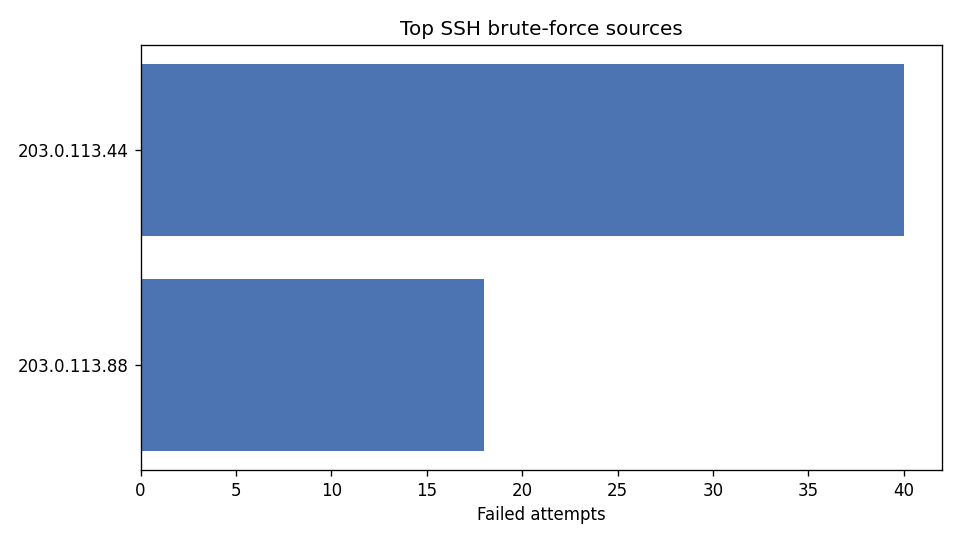

# auth-log-analyzer

[](https://github.com/MEH1999/auth-log-analyzer/actions/workflows/tests.yml)


A lightweight, dependency-free Python tool that parses Linux authentication logs
(`/var/log/auth.log`, `secure`) to surface **failed-login activity** and detect
**SSH brute-force sources** using a sliding-window burst rule.

Built while sharpening my detection-engineering fundamentals — the same triage I
do against SIEM/EDR telemetry, boiled down to the raw log layer.

## Why

Before an alert ever fires in Sentinel, it starts as a line in a log. This tool
recreates that first analytical step: turn thousands of noisy syslog lines into a
short list of IPs worth investigating.

## Detection logic

1. Parse `Failed password`, `Invalid user`, and `Accepted password` events.
2. Aggregate failures **per source IP** and record the targeted usernames.
3. Compute the largest burst of failures inside any `--window`-minute sliding
   window (`O(n)` two-pointer scan).
4. Flag an IP when it clears `--threshold` failures **and** that burst threshold —
   so slow, legitimate retries don't trip the alert.

## Usage

```bash
python auth_log_analyzer.py examples/auth.log
python auth_log_analyzer.py examples/auth.log --threshold 10 --window 5 --year 2025
python auth_log_analyzer.py examples/auth.log --csv report.csv
python auth_log_analyzer.py examples/auth.log --chart top_offenders.png   # optional (needs matplotlib)
```

### Top offenders at a glance



### Example output

```
============================================================
 AUTH LOG ANALYSIS
============================================================
 Unique source IPs : 29
 Failed attempts   : 83
 Successful logins : 2
 Rule              : >= 8 failures in 5 min window
------------------------------------------------------------
 SOURCE IP           FAILS  BURST  TARGETED USERS
 203.0.113.44           40     40  admin, deploy, git, oracle, postgres (+4)
 203.0.113.88           18     17  root
------------------------------------------------------------
 2 IP(s) flagged for brute-force behaviour.
```

## Testing

```bash
python -m pytest        # or: python tests/test_analyzer.py
```

## Skills demonstrated

- Log parsing with `re`, timestamp handling, dataclasses
- Sliding-window burst detection (two-pointer)
- CLI design with `argparse`, CSV reporting
- Mapping raw events to a security signal (MITRE ATT&CK **T1110 – Brute Force**)

## Roadmap

- [ ] GeoIP enrichment for flagged sources
- [ ] JSON output for ingestion into a SIEM
- [ ] `journalctl` / systemd-journal input support
